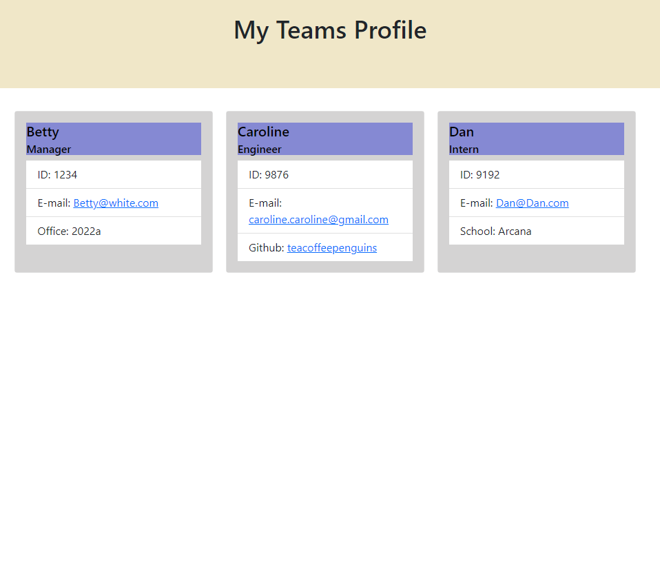

# Team Profile Generator

## About This Project



This project is to streamline the ability to make a Team Profile page by inputting the teams information in a command line interface (CLI). Once the information for the team is filled out, the user may select the option that they are done with their team, and an index.html page will be generated, creating the site for their team. 

To run the program:
```
npm i
node index.js
```
Video Demonstration: 
[Video Demonstrating Program Use](https://www.screencast.com/t/0rWVuYDBVF)

## Built With
- HTML
- CSS
- Bootstrap 5.x
- Node.js
- Inquirer
- Jest

## Contact
- [Live Project Link](https://cpastorelli.github.io/Team_Profile_Generator/)
- [GitHub Repository](https://github.com/cpastorelli/Team_Profile_Generator)

## License
[](https://opensource.org/licenses/MIT)

## Acknowledgements
- [Bootstrap Cards](https://getbootstrap.com/docs/5.0/components/card/)
- [Bootstrap Flex](https://getbootstrap.com/docs/5.0/utilities/flex/)
- [Inquirer](https://www.npmjs.com/package/inquirer)
- [Jest](https://www.npmjs.com/package/jest)
